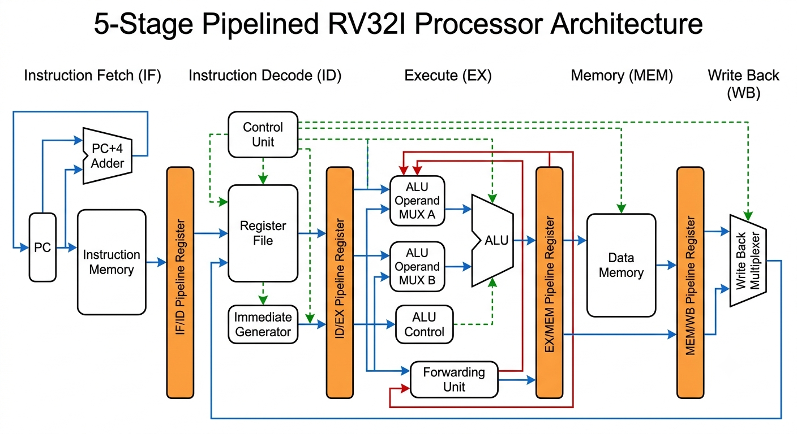
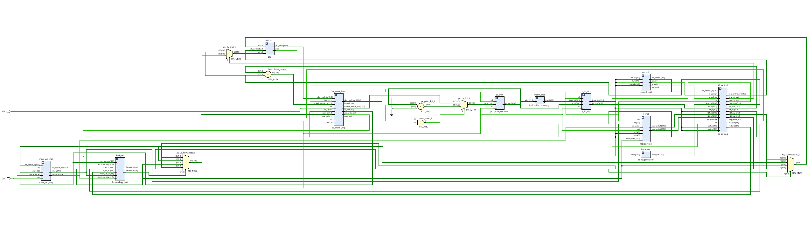
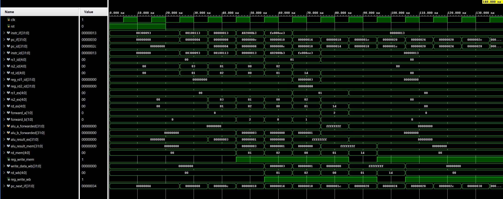

# 5-Stage Pipelined RV32I Processor

A **32-bit RV32I pipelined RISC-V processor** implemented in **Verilog HDL**. The processor follows the classic **5-stage pipeline architecture** (IF, ID, EX, MEM, WB) and incorporates **data forwarding** to reduce read-after-write (RAW) data hazards. The design was functionally verified through RTL simulation and synthesized using **Xilinx Vivado**.

---

## Features

- 32-bit **RISC-V RV32I** processor
- Classic 5-stage pipelined datapath
- Data Forwarding Unit for RAW hazard mitigation
- Modular Verilog HDL implementation
- ALU with dedicated ALU Control
- Register File
- Immediate Generator
- Pipeline Registers (IF/ID, ID/EX, EX/MEM, MEM/WB)
- RTL simulation and functional verification
- Synthesized using Xilinx Vivado

---

## Processor Architecture

<p align="center">
  
</p>

---

## RTL Schematic

<p align="center">
  
</p>

---

## Simulation Results

<p align="center">
  
</p>

---

## Pipeline Stages

| Stage | Function |
|-------|----------|
| **IF** | Fetch instruction from Instruction Memory |
| **ID** | Decode instruction, generate control signals, and read operands from the Register File |
| **EX** | Execute ALU operations and perform operand forwarding |
| **MEM** | Perform load/store operations on Data Memory |
| **WB** | Write execution or memory results back to the Register File |

---

## Major Components

- Program Counter (PC)
- Instruction Memory
- Control Unit
- Register File
- Immediate Generator
- ALU
- ALU Control Unit
- Data Memory
- Forwarding Unit
- IF/ID Pipeline Register
- ID/EX Pipeline Register
- EX/MEM Pipeline Register
- MEM/WB Pipeline Register

---

## Project Structure

```text
Pipelined-RISC-V-Processor
│
├── docs/
│   ├── architecture.png
│   ├── Schematic.png
│   └── riscvsimres.png
│
├── riscv.srcs/
├── README.md
├── .gitignore
└── riscv.xpr
```

---

## Tools & Technologies

- Verilog HDL
- Xilinx Vivado
- RISC-V RV32I ISA
- RTL Simulation
- FPGA Design Flow

---

## Future Enhancements

- Hazard Detection Unit
- Branch Prediction
- Cache Memory Integration
- AXI4/AXI4-Lite Interface
- UART Peripheral Integration
- FPGA Hardware Validation

---

## License

This project is licensed under the MIT License.
